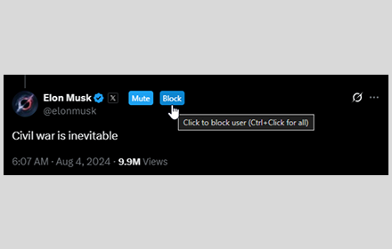

# XTerminator - Chrome Extension



## Overview

**XTerminator** is a Chrome extension that aims to make X/Twitter semi-usable again. It provides:

- One-Click Mute / block buttons directly on user elements
- Automatic detection and removal of any sponsored content
- Removal of premium subscription prompts and upsells
- Elimination of subscription buttons on user profiles
- Local processing with no external data collection
- All fully open source

## Features

- **Quick Fly Swatting:**

  - One-click mute and block buttons right where you need them
  - Control-click to evaporate every account in a particulary toxic rabbit hole
  - Skip X's endless confirmation dialogs

- **Comprehensive Ad Control:**

  - Automatically detect and handle all types of promoted content
  - Configurable behavior (hide, block, or leave as is)
  - Clean up your feed from:
    - Sponsored tweets
    - Promoted accounts
    - Crypto and scam advertisements

- **Premium Subscription Management:**

  - Automatically hide all premium content prompts and upsells
  - Remove subscription-related interruptions:
    - "Want more people to see your reply?" prompts
    - "Remove all ads with Premium+" offers
    - Verified profile upsells
    - Premium sign up tab
  - Hide subscription buttons from other users' profiles
  - Block upgrade interruptions and premium membership pestering

## Installation

1. **Download from Chrome Web Store:**

   - Visit the [Chrome Web Store page](https://chromewebstore.google.com/detail/xterminate/fkcppikhgboddjlcoapmibcpcnlhepko)
   - Click "Add to Chrome"

2. **Install from Source:**
   - Clone this repository:
     ```bash
     git clone https://github.com/bezalel6/XTerminator.git
     ```
   - Open Chrome and navigate to `chrome://extensions/`
   - Enable "Developer mode" at the top right corner
   - Click "Load unpacked" and select the cloned directory

## Usage

1. **Moderate Your Feed:**

   - Click the mute or block button next to any user
   - Hold `Ctrl` and click to perform the action on every account in the current context

2. **Manage Ads:**

   - Sponsored content is automatically handled based on your settings

3. **Configure Settings:**
   - Customizeable promoted content behaviour `nothing`|`hide`|`block` (default: `hide`)
   - Toggle displaying the `Block` and `Mute` buttons above usernames (`enabled` by default)
   - Toggle hiding the constant pestering to buy a premium membership (`enabled` by default)

## Privacy

XTerminator keeps your data private:

- No data collection
- No tracking
- Everything happens in your browser
- No external API calls\*

\* The extension periodically fetches selector definitions from the GitHub repository to keep up with X/Twitter's interface changes. this is fully configurable in the settings, and can be turned off

## Contributing

Help make XTerminator better - contributions are welcome.

## License

This project is licensed under the MIT License - see the LICENSE file for details.
